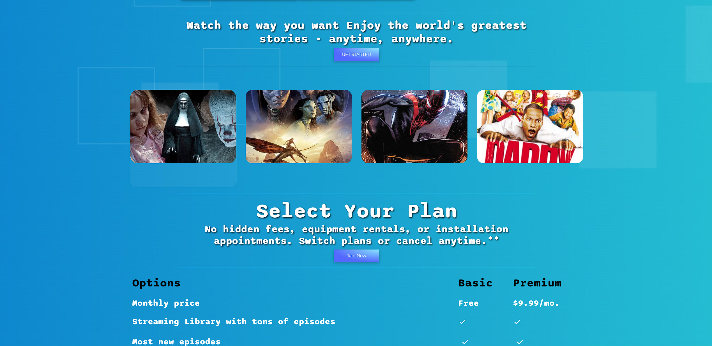
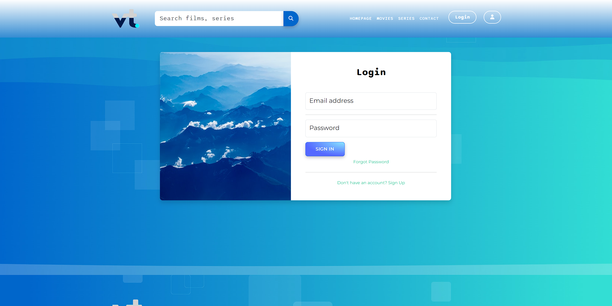

# Viewtopia

Viewtopia is a web application that allows users to explore and watch a vast collection of movies and series. With a user-friendly interface and a wide range of genres, Viewtopia aims to provide an engaging and enjoyable pictural entertainment experience.

## Table of Contents
- [Preview](#preview)
- [Features](#features)
- [Technologies Used](#technologies-used)
- [Getting Started](#getting-started)
- [Installation](#installation)
- [Usage](#usage)
- [Contributing](#contributing)
- [License](#license)

## Preview








## Features

- **Browse Movies and Tv-Shows**: Explore a diverse catalog of movies and series.
- **Search Functionality**: Easily find your favorite movies using the search feature.
- **User Accounts**: Create an account to personalize your experience.
- **Responsive Design**: Enjoy a seamless experience on various devices.
- **Comment Section**: Share your thoughts with fellow viewers.
- **more to come:**
- - **Watchlist**: Save movies to your watchlist for future viewing.

## Technologies Used

- Frontend:
  - HTML5
  - CSS3
  - TypeScript (React.js)
  - React

- Backend:
  - Node.js
  - Express.js
  - MongoDB
  - Mongoose
- [Additional technologies]

- Hosting:
  - Render   

## Getting Started

### A build is deployed on :

[Viewtopia](https://viewtopiafront.onrender.com/)

[Viewtopia-api](https://viewtopiafront.onrender.com/)

To get a local copy of the project up and running, follow these steps:

### Installation

1. Clone the repository: 
   ```bash
   git clone https://github.com/Gerosheng/Get-Flix.git
   cd Get-Flix
2. Install dependencies in root folder, server and client:
2. Install dependencies in root folder, server and client:
    ```bash
    npm install
### Usage
1. Start the application:

    ```bash
    npm run dev 
2. Open your web browser and navigate to http://localhost:5173 (server on port 5050).

3. Explore and enjoy Viewtopia!

### Contributing
We welcome contributions from the community. If you'd like to contribute, please follow these guidelines:

- Fork the repository
- Create a new branch
- Make your changes
- Submit a pull request

For major changes, please open an issue first to discuss the proposed changes.

### Authors
- Yves Bolong [github](https://github.com/Yvessoham)
- Ravi Singh [github](https://github.com/konstiinov)
- Riadh Trabelsi [github](https://github.com/riadh-trabelsi)
- Jérôme Coeckelbergh [github](https://github.com/Gerosheng)
### License
This project ain't licensed to nuttin' yet

Happy Watching! 🎬

